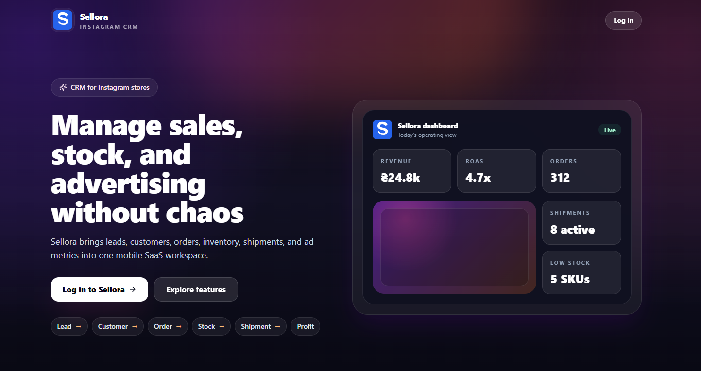
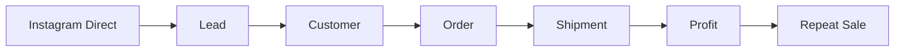
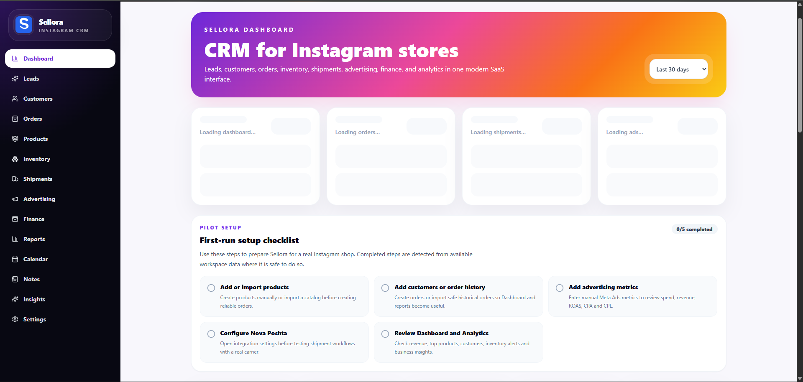
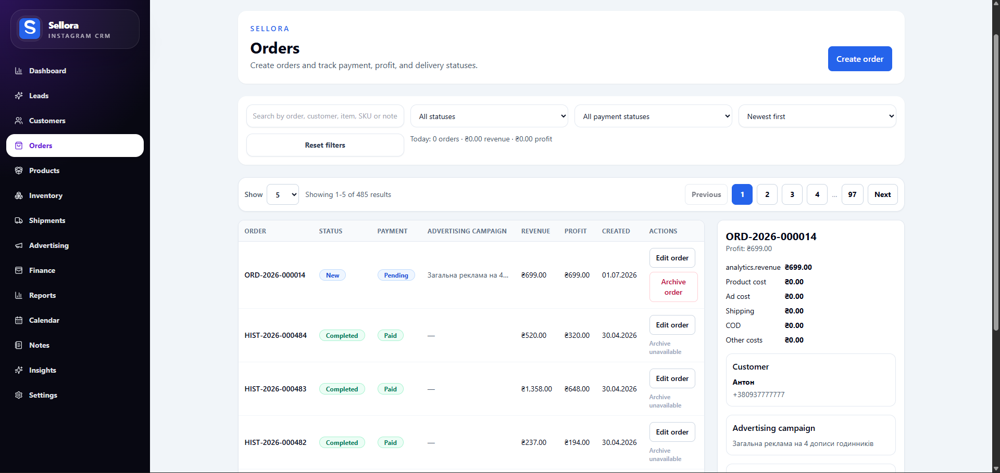
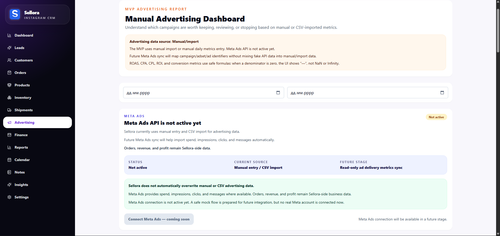
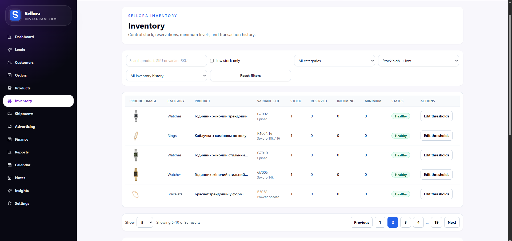

# Sellora

<p align="center">
  
</p>

<p align="center">
  <strong>A modern CRM/ERP workspace for Instagram-first commerce.</strong>
</p>

<p align="center">
  From Direct messages to orders, shipments, profit and repeat sales — beautifully connected.
</p>

<p align="center">
  
  
  
  
</p>

---

<p align="center">
  
</p>

---

## The Idea

Sellora is being built for a new generation of small e-commerce businesses — stores that sell through Instagram, manage customers in Direct, ship with delivery services, track ads manually and still want to understand their real profit.

Not another heavy CRM.

Not another spreadsheet.

A clean operating system for Instagram shops.



---

## What Sellora Connects

<table>
  <tr>
    <td align="center" width="25%">
      <strong>Leads</strong><br/>
      Direct requests, sources, statuses
    </td>
    <td align="center" width="25%">
      <strong>Orders</strong><br/>
      Sales flow, payments, profit
    </td>
    <td align="center" width="25%">
      <strong>Products</strong><br/>
      Catalog, variants, stock
    </td>
    <td align="center" width="25%">
      <strong>Advertising</strong><br/>
      Spend, ROAS, CPA, results
    </td>
  </tr>
  <tr>
    <td align="center">
      <strong>Customers</strong><br/>
      History, notes, repeat sales
    </td>
    <td align="center">
      <strong>Shipments</strong><br/>
      Delivery workflow foundation
    </td>
    <td align="center">
      <strong>Finance</strong><br/>
      Revenue, costs, margin
    </td>
    <td align="center">
      <strong>Analytics</strong><br/>
      Decisions, not just charts
    </td>
  </tr>
</table>

---

## Product Feel

Sellora is designed to feel like a modern SaaS product:

* fast;
* clean;
* mobile-friendly;
* Ukrainian-first;
* simple enough for a shop owner;
* structured enough for a growing team.

The main goal is clarity:

> What happened today?
> What needs attention?
> What actually made profit?

---

## Interface Direction

<p align="center">
  
  
</p>

<p align="center">
  
  
</p>

---

## Built With

<p align="center">
  
  
  
  
  
  
</p>

---

## Under the Hood

The product is built with a SaaS-ready foundation:

```text
Clean Architecture
Modular Monolith
Multi-tenant Workspaces
RBAC
Audit Logging
Soft Delete
Repository / Service Layers
Integration-ready Core
```

Just enough structure to scale.

Not enough chaos to regret it later.

---

## The Vision

Sellora is not only about storing orders.

It is about helping small Instagram shops become real, measurable businesses.

A place where every message, order, product, ad campaign and shipment finally speaks the same language.

---

## Coming Next

Some things are already in motion.

Some things stay behind the curtain for now.

```text
Better analytics
Smarter finance
Safer integrations
Mobile-first workflows
AI-assisted commerce
```

More soon.

---

## Status

Sellora is currently in active MVP development.

The foundation is live, the product is evolving sprint by sprint, and the next focus is turning a working system into a polished SaaS experience.

---

<p align="center">
  <strong>Sellora</strong><br/>
  From Direct to profit.
</p>
