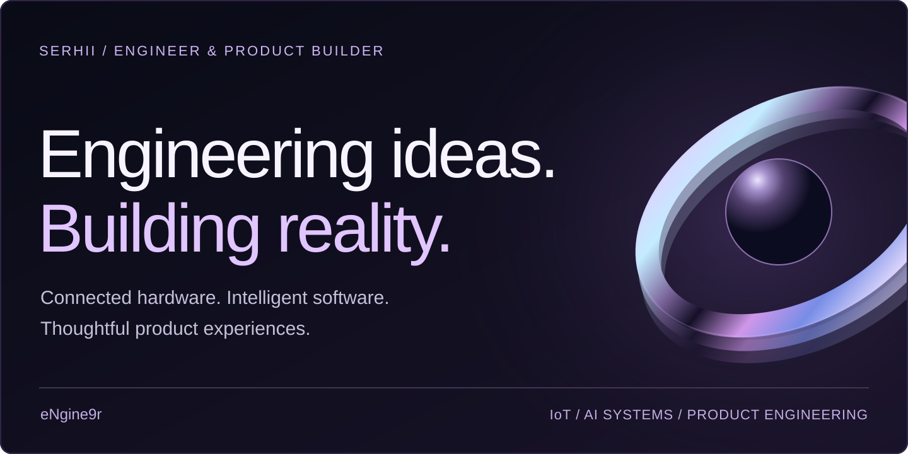
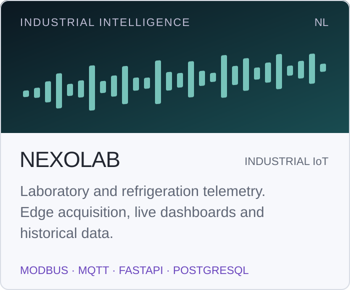
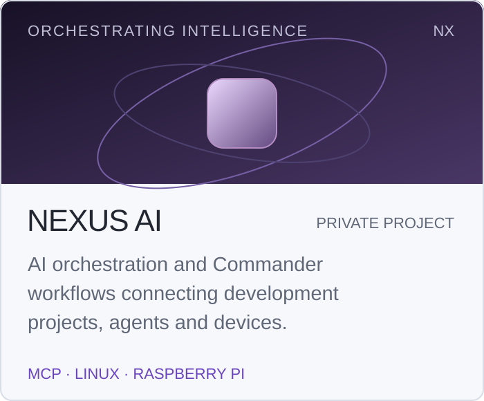
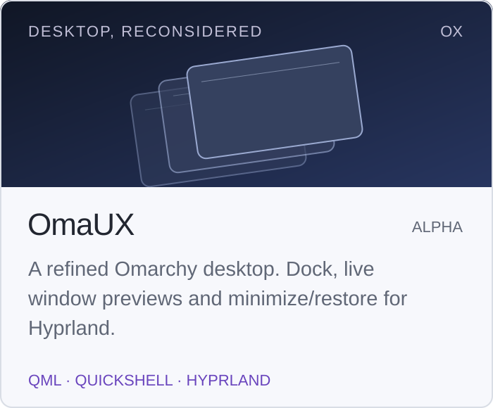
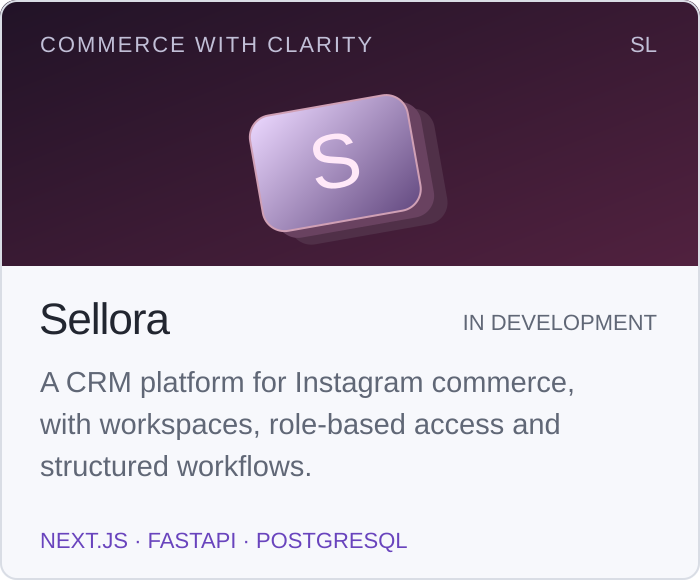
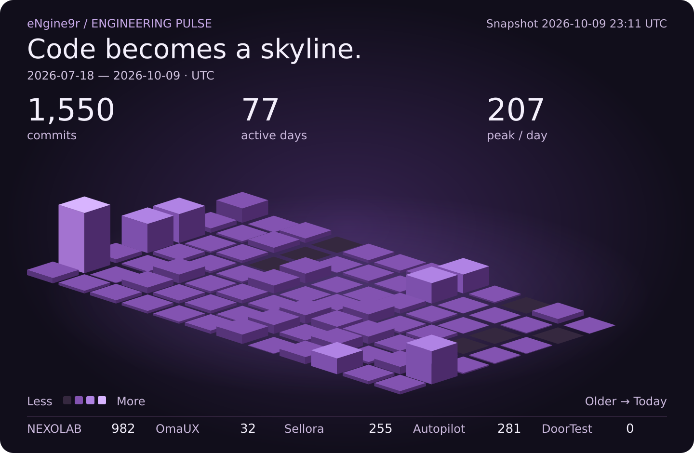
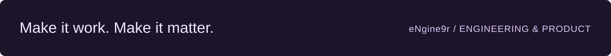

<picture>
  <source media="(max-width: 600px)" srcset="./assets/profile/hero-mobile.svg" />
  
</picture>

**Automation & IoT Engineer · Technical Product Owner**

I turn complex engineering into useful products — from laboratory telemetry and AI orchestration to Linux desktop experiences and commerce software.

[Connect on LinkedIn ↗](https://www.linkedin.com/in/serhii-tymchuk) · [Explore repositories ↗](https://github.com/eNgine9r?tab=repositories)

## Selected work

Hardware ↔ Software ↔ Experience

<table>
  <tr>
    <td width="50%" valign="top">
      <a href="https://github.com/eNgine9r/nexolab-platform">
        <picture>
          <source media="(max-width: 600px) and (prefers-color-scheme: dark)" srcset="./assets/profile/nexolab-mobile-dark.svg" />
          <source media="(max-width: 600px)" srcset="./assets/profile/nexolab-mobile-light.svg" />
          <source media="(prefers-color-scheme: dark)" srcset="./assets/profile/nexolab-dark.svg" />
          
        </picture>
      </a>
    </td>
    <td width="50%" valign="top">
      <picture>
        <source media="(max-width: 600px) and (prefers-color-scheme: dark)" srcset="./assets/profile/nexus-mobile-dark.svg" />
        <source media="(max-width: 600px)" srcset="./assets/profile/nexus-mobile-light.svg" />
        <source media="(prefers-color-scheme: dark)" srcset="./assets/profile/nexus-dark.svg" />
        
      </picture>
    </td>
  </tr>
  <tr>
    <td width="50%" valign="top">
      <a href="https://github.com/eNgine9r/omaux">
        <picture>
          <source media="(max-width: 600px) and (prefers-color-scheme: dark)" srcset="./assets/profile/omaux-mobile-dark.svg" />
          <source media="(max-width: 600px)" srcset="./assets/profile/omaux-mobile-light.svg" />
          <source media="(prefers-color-scheme: dark)" srcset="./assets/profile/omaux-dark.svg" />
          
        </picture>
      </a>
    </td>
    <td width="50%" valign="top">
      <a href="https://github.com/eNgine9r/sellora">
        <picture>
          <source media="(max-width: 600px) and (prefers-color-scheme: dark)" srcset="./assets/profile/sellora-mobile-dark.svg" />
          <source media="(max-width: 600px)" srcset="./assets/profile/sellora-mobile-light.svg" />
          <source media="(prefers-color-scheme: dark)" srcset="./assets/profile/sellora-dark.svg" />
          
        </picture>
      </a>
    </td>
  </tr>
</table>

**More engineering:** [Project Autopilot ↗](https://github.com/eNgine9r/chatgpt-autopilot) — development supervision · [Door Test Controller ↗](https://github.com/eNgine9r/lab_test_ref_door_iso23953) — laboratory test automation.

Project index — descriptions and links

- **[NEXOLAB](https://github.com/eNgine9r/nexolab-platform)** — An industrial IoT platform for laboratory and refrigeration monitoring. Connects Modbus edge acquisition, MQTT transport, PostgreSQL history and live dashboards.
- **NEXUS AI** — A private project for AI orchestration and Commander workflows across development projects and devices.
- **[OmaUX](https://github.com/eNgine9r/omaux)** — A modular desktop UX pack for Omarchy and Hyprland, with a Dock, live window previews, persistent app pinning and minimize/restore workflows. In alpha development.
- **[Sellora](https://github.com/eNgine9r/sellora)** — A CRM platform in development for Instagram commerce, built around workspaces, role-based access and structured business workflows.
- **[Project Autopilot](https://github.com/eNgine9r/chatgpt-autopilot)** — A supervisor for development projects, persistent sessions and intervention alerts.
- **[Door Test Controller](https://github.com/eNgine9r/lab_test_ref_door_iso23953)** — Raspberry Pi automation of refrigeration door test sequences over RS-485 Modbus RTU.

<!-- engineering-pulse:start -->
## Engineering pulse

<picture>
  <source media="(max-width: 600px)" srcset="./assets/activity/commit-city-mobile-082b4e46f443.svg" />
  
</picture>

Activity scope and updates

Actual commits across NEXOLAB, OmaUX, Sellora, Project Autopilot and Door Test Controller. All authors; default branches; merge commits included; grouped by committer date in UTC. Private projects are omitted. This is independent of GitHub's contribution graph.

Checked every 15 minutes; GitHub Actions may delay scheduled runs. A new snapshot is published when the counts or date window change. The snapshot time appears in the image. Reload the profile to see published changes.

[Snapshot data](./assets/activity/snapshot.json) · [Update workflow](https://github.com/eNgine9r/eNgine9r/actions/workflows/update-activity.yml)

<!-- engineering-pulse:end -->

## Across the stack

From signal to interface.

`Python` `TypeScript` `React / Next.js` `FastAPI` `PostgreSQL / SQLite` `Docker / Linux` `RS-485 / Modbus` `MQTT / WebSocket` `QML / Hyprland`

How I approach engineering

Start with the real workflow. Connect hardware and software through clear interfaces. Make system states visible. Build for maintainability, testability and a useful experience.

 

<picture>
  <source media="(max-width: 600px)" srcset="./assets/profile/footer-mobile.svg" />
  
</picture>
